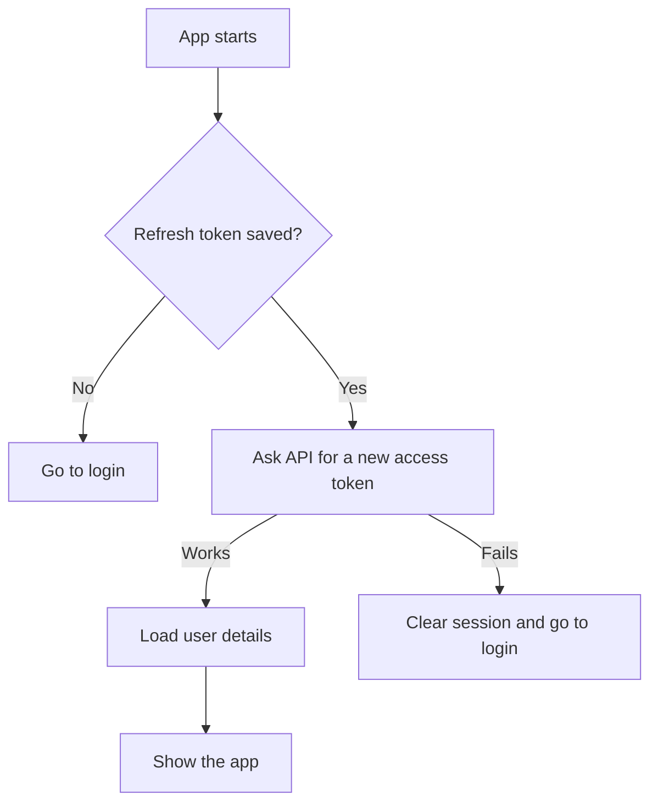
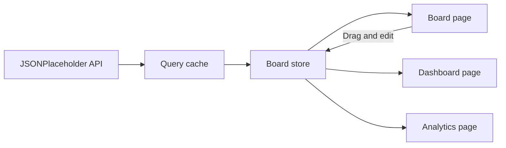
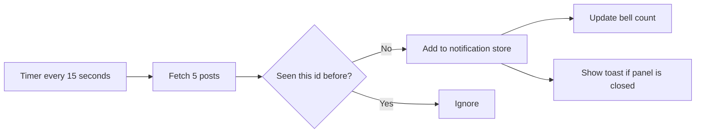

# Architecture

SprintDesk is a single page sprint management dashboard. It runs entirely in the browser and has no backend of its own. All data comes from two public APIs, which are documented in [API.md](./API.md).

## Technology choices

| Area | Choice | Reason |
| --- | --- | --- |
| UI library | React 19 | Meets the React 18 or higher requirement. Next.js, Remix and Create React App were not allowed. |
| Language | TypeScript, strict mode | Also uses `noUnusedLocals`, `noUnusedParameters` and `noFallthroughCasesInSwitch`. |
| Build tool | Vite 8 | Fast development server, and it splits the build into separate files automatically. |
| Server data | TanStack Query 5 | Handles the three network reads: board data, notification polling and the login request. |
| App state | Zustand 5 | Five small stores, one for each area of the app. |
| Styling | Tailwind CSS 3.4 with CSS variables | No component library was used. Every component is written from scratch. |
| Routing | React Router 7 | Nested layout route with a guard in front of it. |
| Charts | Recharts 3 | Four charts that resize to fit the screen. |
| Drag and drop | dnd-kit 6 | Supports both mouse and keyboard. |
| Testing | Vitest 4 and React Testing Library 16 | 77 tests covering stores, calculations, the auth interceptor and component behaviour. |

## Layers

The code is split into layers. A layer can use the layers below it, but never the ones above.

```
routes/        Which URL shows which page, and who is allowed in
features/      auth, board, analytics, dashboard, notifications
components/    Shared building blocks and the page frame
store/         The five Zustand stores
lib/           Axios setup and the token refresh logic
types/         Shared TypeScript types
```

This means a change to a button cannot break the login logic, because the button layer sits below it and does not know it exists.

## Folder structure

```
src/
  components/
    Layout.tsx           Sidebar, header and page frame
    ui/                  Button, Input, Select, Modal, Toast, DataTable,
                         Skeleton, FullScreenLoader, ThemeToggle,
                         useToast, useFocusTrap
  features/
    auth/                LoginPage, authApi, useSessionInit, passwordStrength
    board/               BoardPage, boardApi, useEnsureBoardLoaded, components/
    analytics/           AnalyticsPage, analyticsSelectors
    dashboard/           DashboardPage
    notifications/       NotificationBell, NotificationPanel, polling hook, API
  lib/axios.ts           Two Axios instances and the refresh interceptor
  routes/                AppRouter and ProtectedRoute
  store/                 auth, board, notification, toast, theme
  types/index.ts         Shared types
design/                  Design tokens for light and dark theme
docs/                    This file, API.md and openapi.yaml
```

Each feature folder holds everything for that feature: its page, its API calls, its hooks and its own components. If you are fixing something on the board, everything you need is in one folder.

The rule for moving code out of a feature folder is simple. If two features need it, it moves down a layer. That is how the buttons and inputs ended up in `components/ui`, and how the shared types ended up in `types`.

There is one exception. The dashboard and analytics pages import `useEnsureBoardLoaded` from the board folder, because the board is their data source. Copying that fetch logic into three places would have been worse.

## State management

The project splits state by who owns it.

Server state is data that belongs to an API. It can change without the app knowing, so it needs caching and refetching. TanStack Query handles this.

Client state is data the app owns once it has arrived. Nothing else is changing it, so it just needs somewhere to live. Zustand handles this.

| Store | Holds | Saved to browser |
| --- | --- | --- |
| auth | User, access token, and whether the session check is still running | Only the refresh token |
| board | Tasks, column order, filters, last move, loaded flag | Yes, using localStorage |
| notification | Last 20 notifications, seen post ids, poll position | Yes, using localStorage |
| toast | Messages currently on screen | No |
| theme | Light or dark | Yes, as a plain string |

The theme store writes a plain string instead of using the Zustand persist middleware. This is so the small script in `index.html` can read it before the page is drawn and set the theme immediately, which avoids a flash of the wrong colours.

### How the board store is shaped

The board does not keep four lists of task objects. It keeps two things instead:

- `tasks`, a lookup of every task by its id
- `columns`, four lists that only contain id numbers

The order of a column lives in its id list. The content of a task lives in the task lookup.

There are three reasons for this:

1. Each task exists in exactly one place, so it cannot be updated in one view and stale in another.
2. Moving a card rewrites two short lists of numbers instead of moving objects between lists.
3. Tasks that were not touched keep the same object reference when the store updates. This is what lets `React.memo` skip redrawing the other cards.

## Data flow

### Starting the app



A full screen loading state is shown for this whole check. No protected page is drawn until it finishes, so a page never appears with half a session.

### Board data

The board is fetched once and used by three pages.



All three pages call the same hook, which uses the same query key, so the data is only requested once. The store fills itself only the first time. After that a page refresh loads the saved board instead of fetching again, so local changes are not lost.

Because the dashboard and analytics pages read from the same store the board writes to, moving a card updates the summary numbers and the charts straight away. No code connects those pages together.

`App.tsx` also requests the board as soon as it knows a session exists, so the data is usually ready before the user navigates.

The board store sets `completedAt` on a task the moment it moves into the Done column, and clears it if the task moves back out. This was added so the completion trend chart shows real events instead of made up dates.

### Analytics calculations

`features/analytics/analyticsSelectors.ts` holds four plain functions. They take the task list and return numbers. They do no fetching and change nothing, which also makes them easy to test.

| Chart | Function | What it returns |
| --- | --- | --- |
| Task status | `getStatusDistribution` | How many tasks are in each of the four columns |
| Priority breakdown | `getPriorityBreakdown` | Low, medium and high counts inside each column |
| Sprint velocity | `getSprintVelocity` | Completed against total, grouped by the week a task is due |
| Completion trend | `getCompletionTrend` | A running total of completed tasks by day |

JSONPlaceholder has no idea of a sprint, so a sprint is treated as the calendar week of a task's due date. This is written down rather than hidden.

### Notifications



Polling stops while the browser tab is hidden and starts again when it becomes visible.

## Routing

| Route | Guard | Loading |
| --- | --- | --- |
| `/login` | Sends you to the dashboard if already logged in | Lazy loaded |
| `/dashboard` | Login required | Lazy loaded |
| `/board` | Login required | Lazy loaded |
| `/analytics` | Login required | Lazy loaded |
| `/` and unknown URLs | Redirect to the dashboard | Not applicable |

The three private routes sit inside one layout route. This means the sidebar, theme toggle and notification bell are created once and stay on screen while you move between pages. Only the middle of the page changes.

`ProtectedRoute` saves the page you were trying to open before redirecting you to login, so after signing in you land on that page instead of the dashboard.

## Design system

`tailwind.config.js` holds the design tokens from the files in `design/`: colours, text sizes, spacing and corner radius.

Every colour is a Tailwind colour backed by a CSS variable, for example `--color-surface` and `--color-primary`. Light values are set on `:root` and dark values on `:root.dark`.

Because of this, a component written with class names like `bg-surface-bright` and `text-on-surface` works in both themes with no extra dark mode styles anywhere in the app.

Charts are the one exception. Recharts takes colours as plain values rather than class names, so chart gridlines, axis text and tooltips are looked up from a small per theme object. The colours that carry meaning, such as which column or which priority a bar represents, stay the same in both themes, because those colours identify data rather than decorate a surface.

`useFocusTrap` is shared by `Modal` and `TaskDrawer`. It moves focus into the dialog when it opens, keeps Tab and Shift+Tab inside it, and returns focus to the element that opened it.

## Performance

| Technique | Where it is used |
| --- | --- |
| Route level code splitting | All four pages use `React.lazy` and `Suspense`. Recharts, the largest dependency, only downloads when the analytics page is opened. |
| `React.memo` | `TaskCard` and `BoardColumn`. Opening a drawer or a modal redraws no board content, and editing one task redraws one card. |
| `useCallback` | Every handler in `BoardPage` that is passed to those memo components. Without it the memo would have no effect. |
| `useMemo` | Filtered columns, the four analytics calculations, the dashboard totals and the table sorting. |
| Shared query | One board request serves three pages, and it is requested early at startup. |
| Deferred charts | A chart is only built once it is close to being scrolled into view. |
| Font subsetting | The icon font is requested with only the icons this app uses, which reduces it from about 4 MB to about 4 KB. |
| Preconnect | The browser is told about both API hosts in the first lines of HTML so the connections open in parallel with the JavaScript download. |

## Testing

| Location | What it covers |
| --- | --- |
| `src/store/*.test.ts` | Store logic on its own: add, move, delete, undo, duplicate handling, read state, auto dismiss |
| `src/lib/axios.test.ts` | The auth interceptor, using a scripted Axios adapter instead of a network or a mocking library |
| `src/features/analytics/analyticsSelectors.test.ts` | The four chart calculations |
| `src/components/ui/*.test.tsx` | `useToast`, `DataTable` sorting and keyboard use, the `Modal` focus trap, `Skeleton` and `FullScreenLoader` |
| `src/features/dashboard/DashboardPage.test.tsx` | Page level test covering the summary cards, the task table and sorting |

Stores and calculations are tested directly rather than through the page, because they are already plain functions. Rendering is used only where the behaviour is genuinely about the page, such as focus handling, keyboard use and screen reader labels.

## Known trade-offs

- Task changes are saved in the browser only. JSONPlaceholder accepts changes but does not store them.
- The card position is decided when the card is dropped, not previewed while dragging between columns.
- Dropping a card on the empty part of a column while a filter is active puts it at the end of the full column, not the filtered list.
- The notification source is a fixed set of 100 posts, so polling goes quiet once all of them have been seen.
